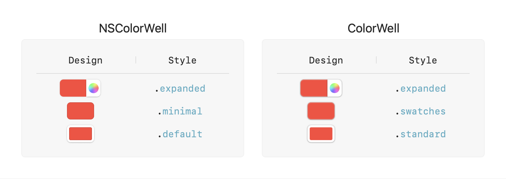

# ColorWell

[![Continuous Integration][ci-badge]](https://github.com/jordanbaird/ColorWell/actions/workflows/main.yml)
[![Release][release-badge]](https://github.com/jordanbaird/ColorWell/releases/latest)
[![Swift Versions][versions-badge]](https://swiftpackageindex.com/jordanbaird/ColorWell)
[![Docs][docs-badge]](https://swiftpackageindex.com/jordanbaird/ColorWell/documentation)
[![License][license-badge]](LICENSE)

A versatile alternative to `NSColorWell` for Cocoa and `ColorPicker` for SwiftUI.

<div align='center'>
    
    
</div>

ColorWell is designed to mimic the appearance and behavior of the new color well design in macOS 13 Ventura, for those who want to use the new design on older operating systems. While the goal is for ColorWell to look and behave in a similar way to Apple's design, it is not an exact clone. There are a number of subtle design differences ranging from the way system colors are handled to the size of the drop shadow. However, in practice, there are very few notable differences:

<div align='center'>
    <picture>
        <source media='(prefers-color-scheme: dark)' width='75%' srcset='Sources/ColorWell/Documentation.docc/Resources/design-comparison-dark.png'>
        
    </picture>
</div>

## Install

Add the following dependency to your `Package.swift` file:

```swift
.package(url: "https://github.com/jordanbaird/ColorWell", from: "0.1.3")
```

## Usage

[Read the full documentation here](https://swiftpackageindex.com/jordanbaird/ColorWell/documentation)

### SwiftUI

Create a `ColorWellView` and add it to your view hierarchy. There are a wide range of initializers to choose from, allowing you to set the color well's color, label, and action.

```swift
struct ContentView: View {
    @Binding var fontColor: Color

    var body: some View {
        VStack {
            ColorWellView(color: fontColor) { newColor in
                fontColor = newColor
            }

            // ...
            // ...
            // ...

            CustomTextEditor(fontColor: $fontColor)
        }
    }
}
```

### Cocoa

Create a `ColorWell` using one of the available initializers. Observe color changes using the `onColorChange(perform:)` method.

```swift
let fontColor = NSColor.black

let textEditor = CustomNSTextEditor(fontColor: fontColor)
let colorWell = ColorWell(color: fontColor)

colorWell.onColorChange { newColor in
    textEditor.fontColor = newColor
}
```

## License

ColorWell is available under the [MIT license](LICENSE).

[ci-badge]: https://img.shields.io/github/actions/workflow/status/jordanbaird/ColorWell/main.yml?branch=main&style=flat-square
[release-badge]: https://img.shields.io/github/v/release/jordanbaird/ColorWell?style=flat-square
[versions-badge]: https://img.shields.io/badge/dynamic/json?color=F05138&label=Swift&query=%24.message&url=https%3A%2F%2Fswiftpackageindex.com%2Fapi%2Fpackages%2Fjordanbaird%2FColorWell%2Fbadge%3Ftype%3Dswift-versions&style=flat-square
[docs-badge]: https://img.shields.io/static/v1?label=%20&message=documentation&logo=data:image/png;base64,iVBORw0KGgoAAAANSUhEUgAAADAAAAAwCAYAAABXAvmHAAAACXBIWXMAAAsTAAALEwEAmpwYAAAAAXNSR0IArs4c6QAAAARnQU1BAACxjwv8YQUAAAEsSURBVHgB7dntDYIwEAbgV+MAuoEj6AaO4AiO4AayAbqBbuAGjoIbwAbnHT8MMTH9uEJrvCch/FB7vEh7EABjjBMRnXhrKY1GxsNUuFhN45gmBKU783lCDKtBiYeoUoeYI79KE6KEACI6RCkBRFSIkgKI4BClBRBBIUoMILxDlBpASIgjtBL3gR2FaV1jzjyKvg98xqDEw615t3Z87eFbc/IAPkJqljwHvFiA3CxAbhaAdI+cNZTUfWD4edQBOMacog9cEE/z25514twsQG4/H2ABJZ5vG97tEefKc/QJhRR9oIH7AeWbjodchdYcSnEJLRGvg5L6EmJb3g6Ic4eSNbLcLEBuf9HIZKnrl0rtvX8E5zLr8w+o79kVbkiBT/yZxn3Z90lqVTDGOL0AoGWIIaQgyakAAAAASUVORK5CYII=&color=informational&labelColor=gray&style=flat-square
[license-badge]: https://img.shields.io/github/license/jordanbaird/ColorWell?style=flat-square
